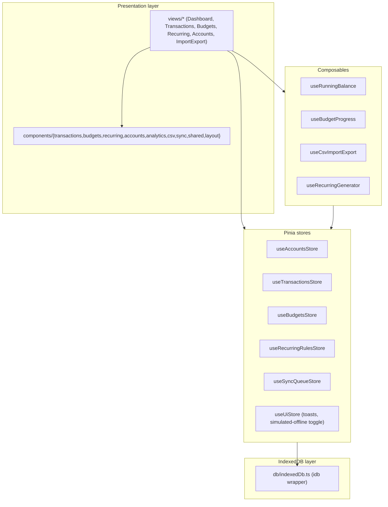

# expense-tracker-vue

An offline-first personal finance tracker built with Vue 3, TypeScript, and the Composition API. All data lives in the browser's IndexedDB — no backend required — with a simulated offline action queue and sync-conflict resolution flow.

## Tech stack

- **Vue 3** (`<script setup>`, Composition API) + **TypeScript**
- **Vite** for dev/build tooling
- **Pinia** for all application state (accounts, transactions, budgets, recurring rules, sync queue, UI)
- **Vue Router 4** for the dashboard/transactions/budgets/recurring/accounts/import-export routes
- **vue-chartjs** + **Chart.js** for the income/expense trend bar chart and category breakdown doughnut chart
- **idb** — a small Promise wrapper around native **IndexedDB**, used as the single persistence layer for every store
- **Tailwind CSS** + CSS custom-property theme tokens (mirrors the `dashboard-vue`/`file-manager-vue` sibling projects' setup)
- **VueUse** (`useMediaQuery`) for the responsive desktop/mobile layout switch

## Getting started

```bash
npm install
npm run dev      # start dev server
npm run build    # type-check + production build
npm run preview  # preview the production build
```

On first load the app seeds IndexedDB with three demo accounts (cash, bank, credit card), ~30 demo transactions spread across the last two months and every category, and six demo budgets for the current month — see `src/data/seed.ts`. The seed only runs once (guarded by a `meta` flag in the database).

## Architecture



### State management

Every domain is a Pinia store, and every mutating store action writes straight through to IndexedDB (`src/db/indexedDb.ts`) so the in-memory `ref` and the persisted copy never drift:

- **`useAccountsStore`** — CRUD for cash/bank/credit accounts, plus the "active account" filter used across Transactions/Dashboard.
- **`useTransactionsStore`** — transaction CRUD. Every write is applied to IndexedDB immediately (offline-first). When the app is offline (real `navigator.onLine === false`, or the demo "Simulate offline" toggle in the sync status bar), the write is *also* pushed onto `useSyncQueueStore` as a queued action.
- **`useBudgetsStore`** — one budget document per `(category, month)`.
- **`useRecurringRulesStore`** — recurring rule CRUD (create/cancel/reactivate/delete); rules track `lastGeneratedDate` so generation is idempotent.
- **`useSyncQueueStore`** — the offline action queue and conflict list (see below).
- **`useUiStore`** — toasts and the "simulate offline" switch used for demoing the sync flow without needing devtools network throttling.

### IndexedDB schema (`src/db/indexedDb.ts`)

Database `expense-tracker-db`, version 1, object stores:

| Store | Key | Indexes | Notes |
|---|---|---|---|
| `accounts` | `id` | `by-createdAt` | cash / bank / credit accounts |
| `transactions` | `id` | `by-date`, `by-account`, `by-category` | income/expense records, may carry `recurringRuleId` |
| `budgets` | `id` | `by-month`, `by-category` | one row per category+month |
| `recurringRules` | `id` | `by-active` | recurrence definitions |
| `syncQueue` | `id` | `by-createdAt` | pending create/update/delete actions queued while offline |
| `syncConflicts` | `id` | `by-detectedAt` | conflicts detected on replay, with a snapshot of the simulated remote state |
| `meta` | `key` | — | misc flags (seed-run marker) |

### Recurring generation logic (`useRecurringGenerator`)

`runGeneration()` runs once on app boot (after seeding) and again after a rule is created or reactivated. For each **active** rule it computes a cursor date — either the rule's `startDate` (first run) or one interval past `lastGeneratedDate` — and steps forward by the rule's frequency (`daily`/`weekly`/`biweekly`/`monthly`/`yearly`), emitting one transaction instance per step, until the cursor passes either:

1. a rolling horizon of **today + 60 days**, or
2. the rule's `endDate`, if set,

whichever comes first. Each generated transaction carries `recurringRuleId` so it's visually tagged in the list and excluded from double-generation — after a batch is generated, `lastGeneratedDate` is advanced to the last instance's date, so re-running generation is a no-op until either time passes or the horizon moves.

### Budget calculation (`useBudgetProgress`)

For a given month, each budget is joined against the sum of `expense` transactions in that `(category, month)`. The composable returns `spent`, `remaining`, `percent` (`spent / limit * 100`, rounded), and a `status` of `ok` (< 75%), `warning` (75–99%), or `over` (≥ 100%) — which drives the green/amber/red progress bar color in `BudgetProgressBar.vue`.

### Multi-account running balances (`useRunningBalance`)

Each account's balance is `openingBalance + Σ income - Σ expense` over that account's own transactions, recomputed reactively as transactions change. The Accounts view lets you tap a card to filter the whole app (Transactions list, Dashboard charts) down to that single account, or "Show all accounts" to combine them.

### CSV import / export (`useCsvImportExport`)

- **Export** builds a CSV in-memory (`date,type,category,amount,accountId,note`) and triggers a client-side download via an object URL — no server round trip.
- **Import** is a three-step wizard (`components/csv/ImportWizard.vue`): upload a file → map its columns to the five required fields (auto-guessed from the header row by name) → a validation preview that flags each row valid/invalid (bad date format, unknown category/account, non-positive amount, etc.) before anything is committed. Only valid rows are inserted, each going through the normal `addTransaction` path (so an import performed while offline is queued for sync just like a manual entry).

### Offline sync queue & conflict resolution (mirrors `file-manager-vue`'s `useSyncQueueStore` pattern)

Every transaction write made while offline is queued in `useSyncQueueStore` (persisted to the `syncQueue` store) in addition to being applied locally, so the UI never blocks on connectivity. The `SyncStatusBar` component (shown on the Dashboard) reports the queue depth and offers a **"Simulate offline"** toggle for demoing this without real network throttling.

When connectivity returns, `flush()` replays each queued action against the current in-memory transaction list. This is a client-only demo, so "remote state" is simulated: each action has a chance of conflicting (a random roll, or the target transaction genuinely missing locally), which mimics what a real backend's `409 Conflict` would look like. A conflicting action is moved into `syncConflicts` with a snapshot of what the simulated remote record looks like now.

The **`ConflictBanner`** component (rendered above every view, same placement as in `file-manager-vue`) lists open conflicts with two resolutions:

- **Keep my change** — discards the conflict, keeps the locally-queued version, clears `pendingSync`.
- **Accept remote** — overwrites the local record with the simulated remote snapshot (or removes it, if the remote deleted it).

Either resolution removes the conflict and the underlying queue entry, and the transactions store re-reads from IndexedDB so the UI reflects whichever side won.

### Responsive layout

`App.vue` uses `useMediaQuery('(min-width: 1024px)')` to switch between:

- **Desktop (≥1024px):** a persistent left sidebar (`Sidebar.vue`) next to the routed view — dashboard content and lists sit side-by-side within each view's own grid.
- **Mobile (<1024px):** the sidebar is replaced by a fixed bottom nav bar (`BottomNav.vue`, `safe-bottom` padding for notched devices), and view layouts stack into a single column.

## Folder structure

```
src/
  main.ts, App.vue        — app bootstrap, seeding, store/router wiring, responsive shell
  router/                 — route table
  style.css               — Tailwind entry + CSS theme tokens
  types/                  — Account, Transaction, Budget, RecurringRule, Sync types
  db/indexedDb.ts          — idb wrapper: schema + CRUD helpers for every store
  data/seed.ts             — first-load demo data
  stores/                  — Pinia stores (accounts, transactions, budgets, recurringRules, syncQueue, ui)
  composables/              — useRunningBalance, useBudgetProgress, useCsvImportExport, useRecurringGenerator, useToast, useOnlineStatus, useFormat
  components/
    layout/                — Sidebar, BottomNav
    transactions/           — TransactionForm, TransactionRow
    budgets/                — BudgetForm, BudgetProgressBar
    recurring/               — RecurringRuleForm, RecurringRuleRow
    accounts/                 — AccountForm, AccountCard
    analytics/                 — TrendChart, CategoryPieChart, DateRangePicker
    csv/                       — ImportWizard
    sync/                       — ConflictBanner, SyncStatusBar
    shared/                      — Modal, StatCard, Toast
  views/                    — DashboardView, TransactionsView, BudgetsView, RecurringView, AccountsView, ImportExportView
```
